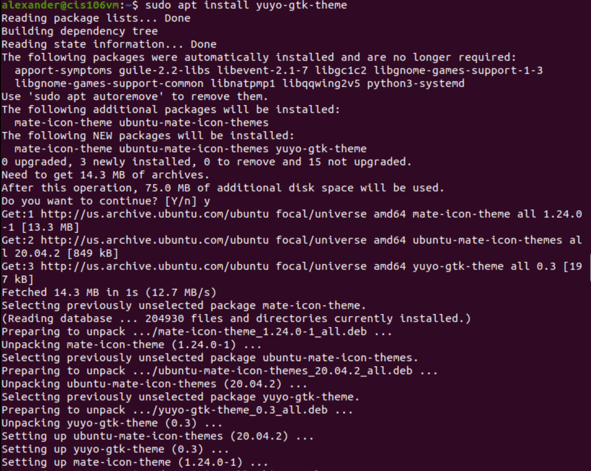
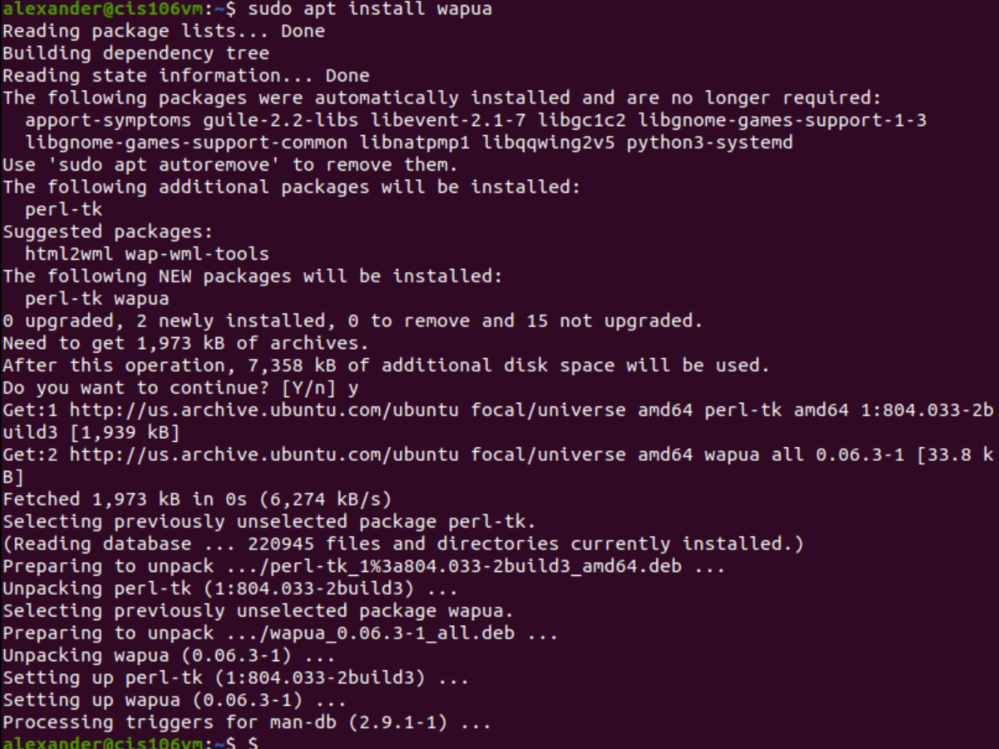
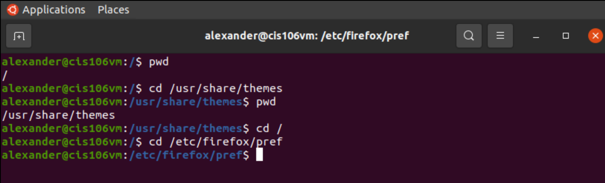
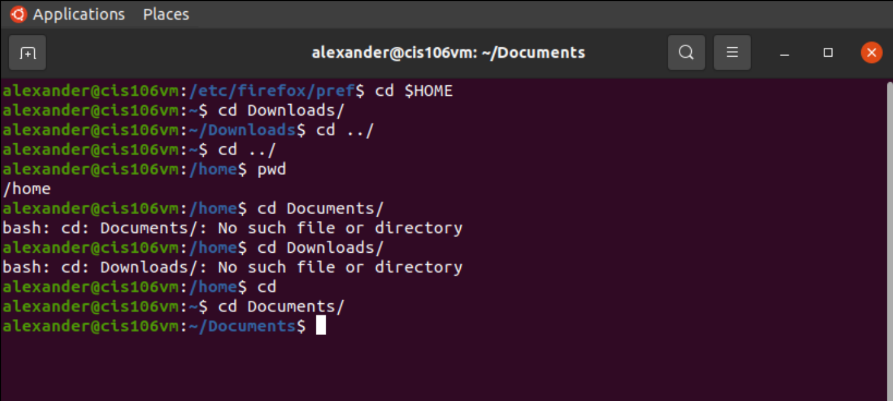
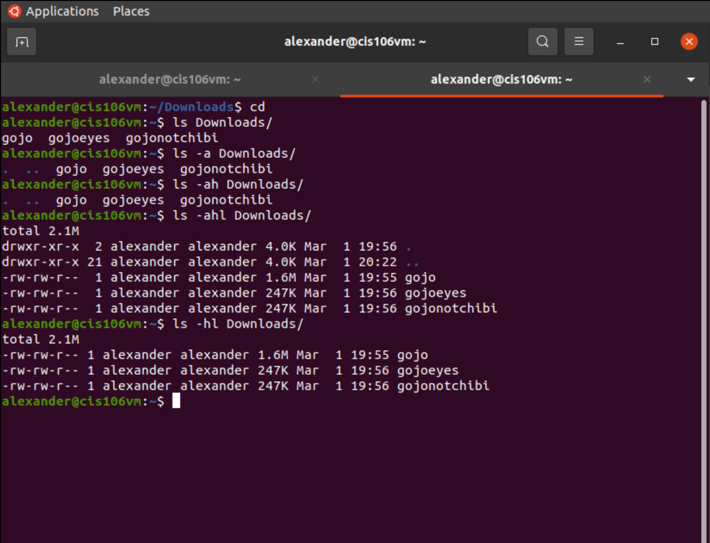
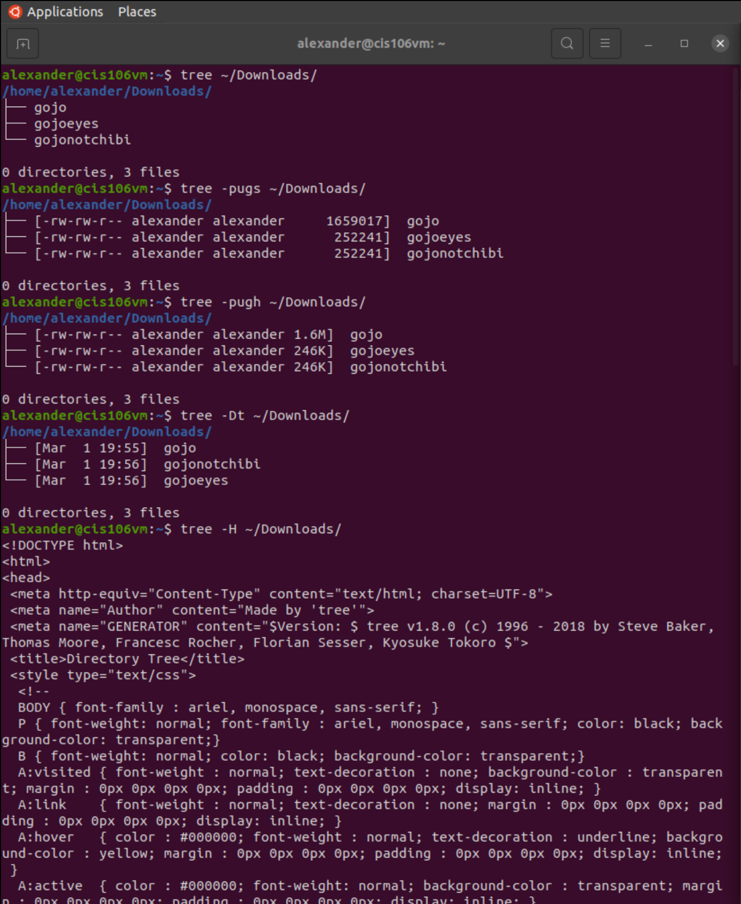
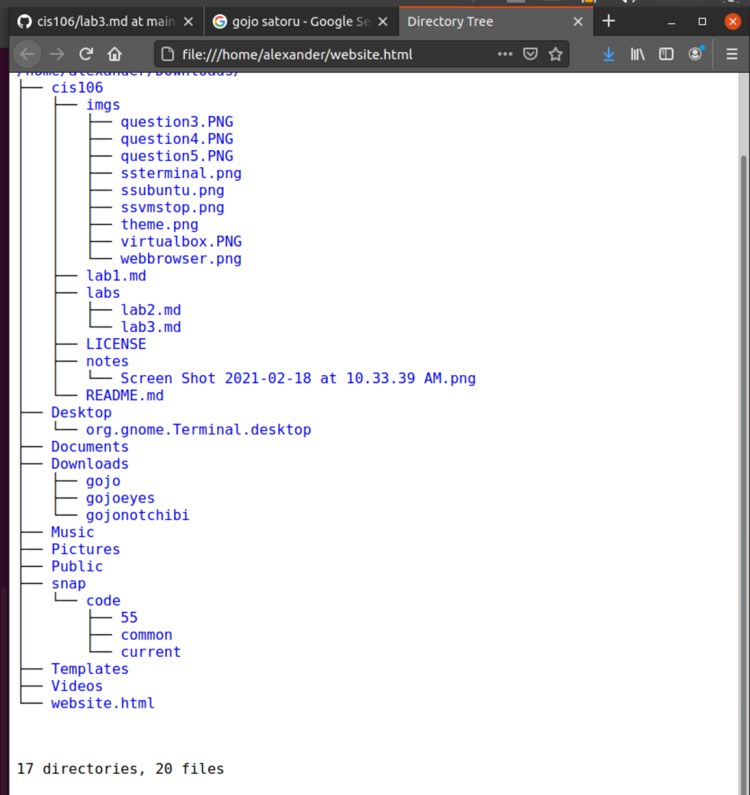
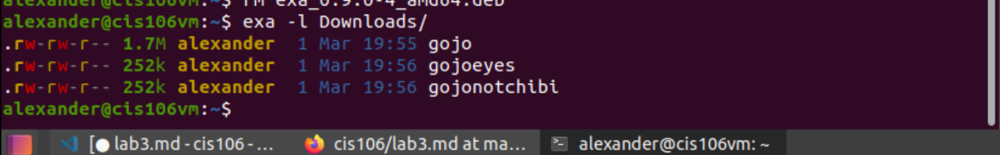
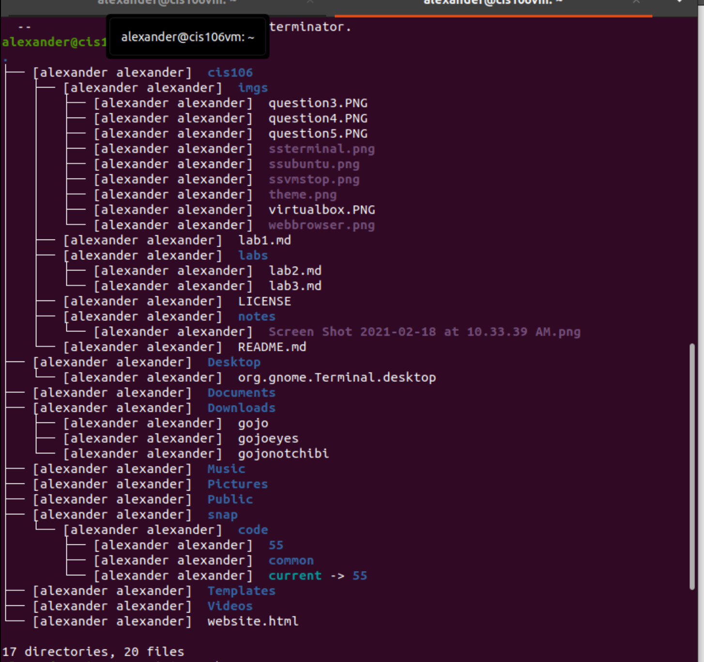
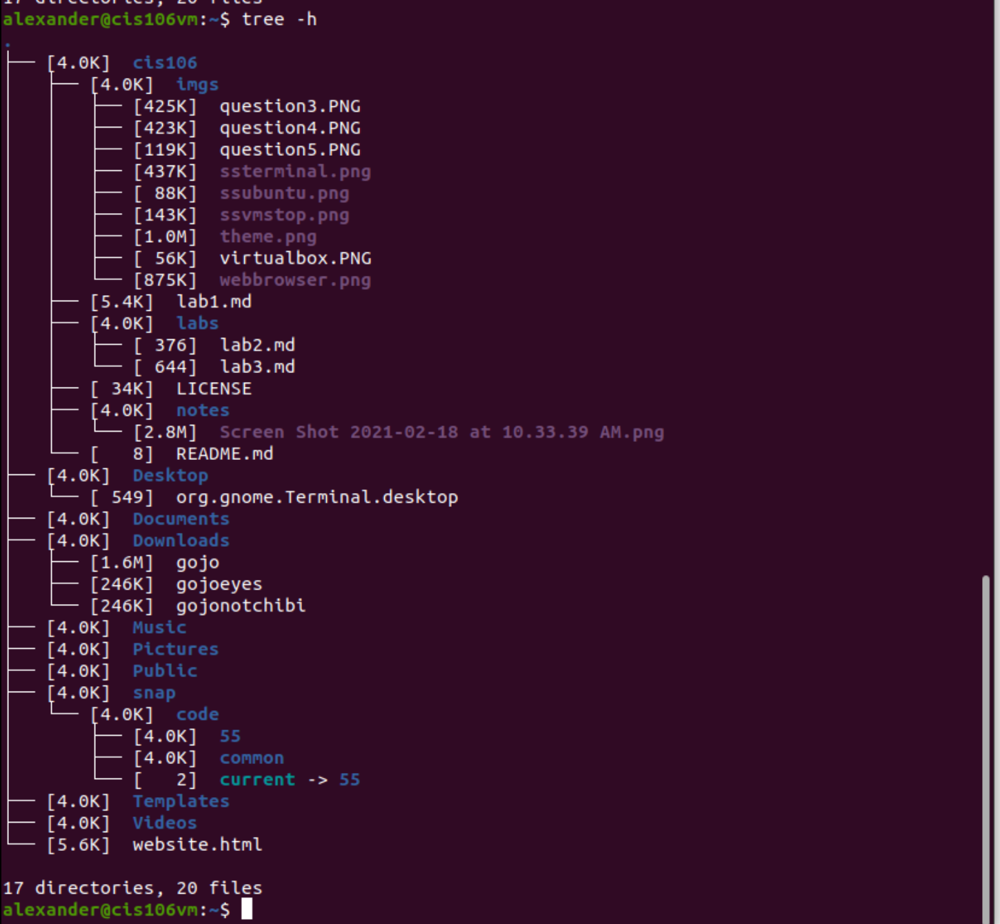

# Lab 3 | Installing software and navigating the file system | Answers
Assignment description [here](https://raw.githubusercontent.com/ra559/cis106/main/labs/lab3.md)

## Question 1
1. Which command did you use to search for the themes and to install them?
apt search themes and sudo apt install yoyu-gtk-themes

2. Which commands did you use to find and install the web browser?
apt search web browser and sudo apt install wapua

3.1 What is the name of the package?
name of application is yuyo-gtk-themes and wapua

3.2 What dependencies are needed in order to install the package? (you can either take a screenshot of the terminal or copy and paste from the terminal)

3.3 How much disk space will the package utilize after installation?
For themes 14.3 MB will be utilized and 75 MB after installation
For web browser 1973 KB will be utilized and 7358 KB after installation

## Question 2

## Question 3

## Question 4

## Question 5

