# Question 1
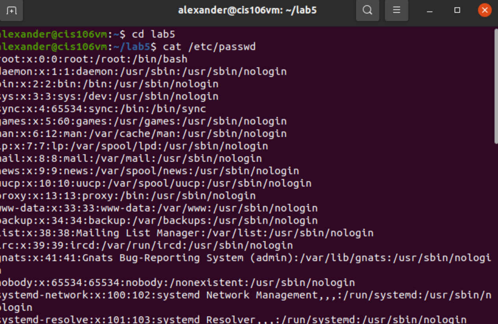
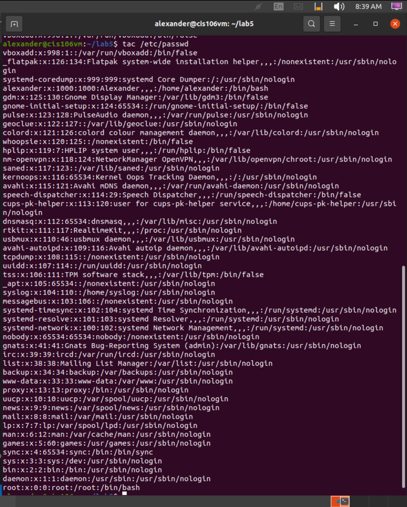
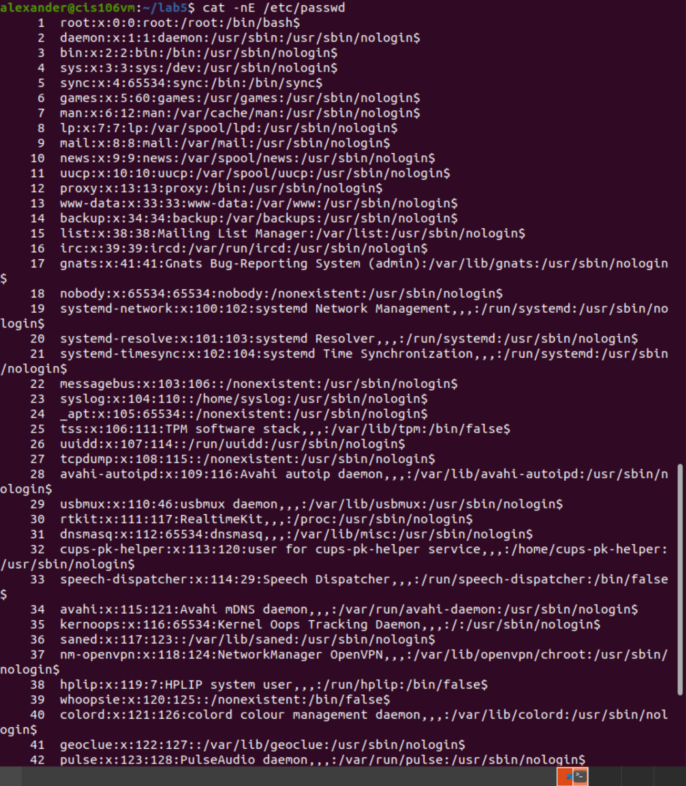
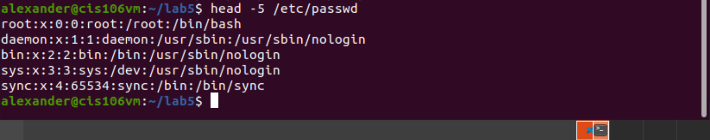
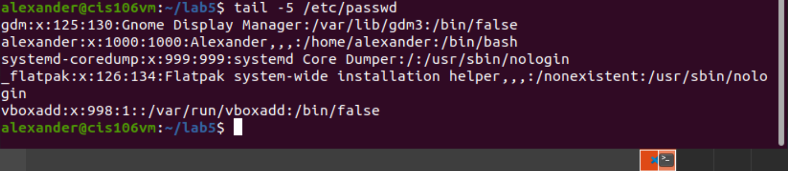

# Question 2
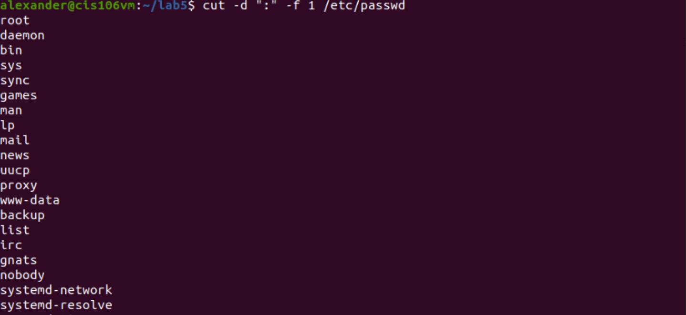
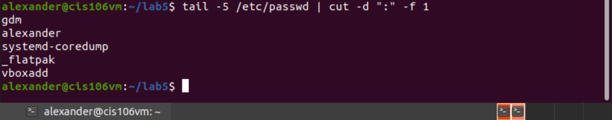
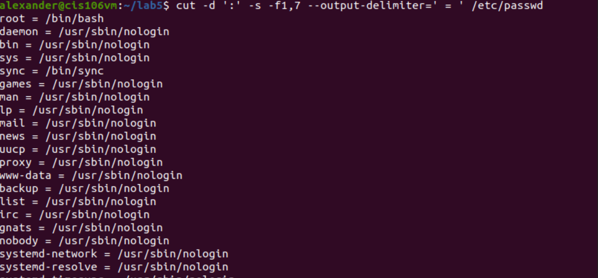
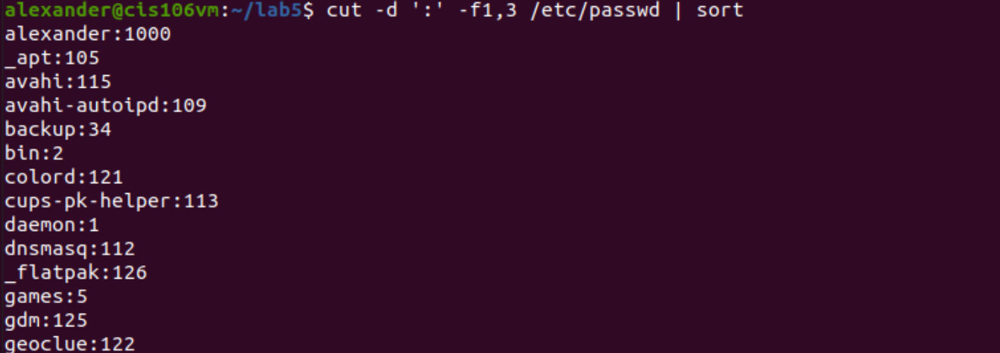
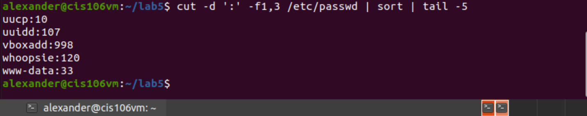

# Question 3
**1.** There is 48 lines in the file
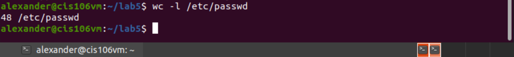
**2.** There is 2888 words in the file
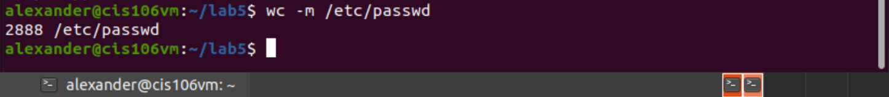
**3.** There are 2 users using the /bin/bash shell
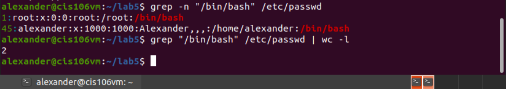
**4.** There are 38 users using the /sbin/nologin shell
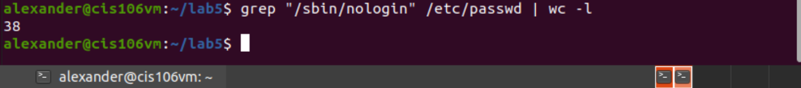
**5.**

# Question 4
**1.** I got 4 lines
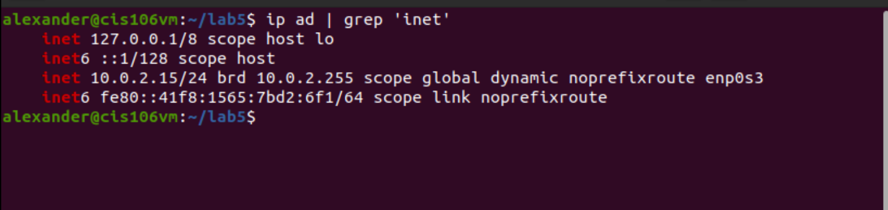
**2.**
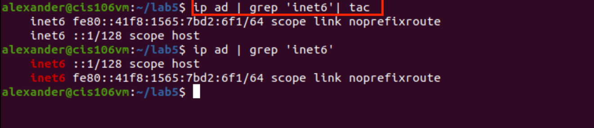
**3.**
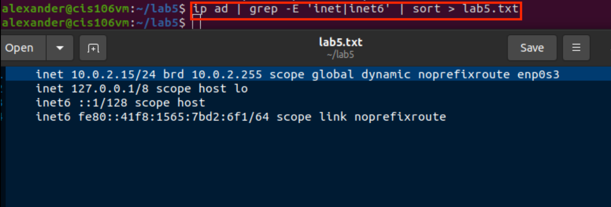
**4.**
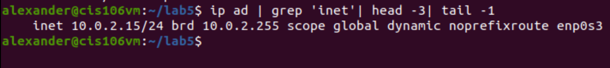
**5.**
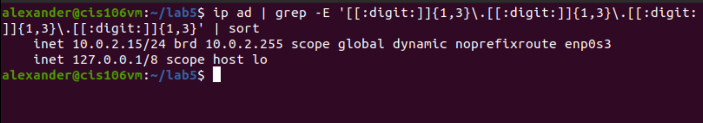

# Question 5
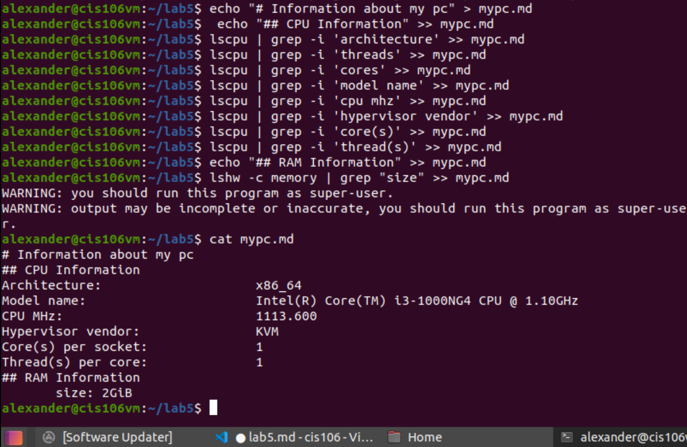