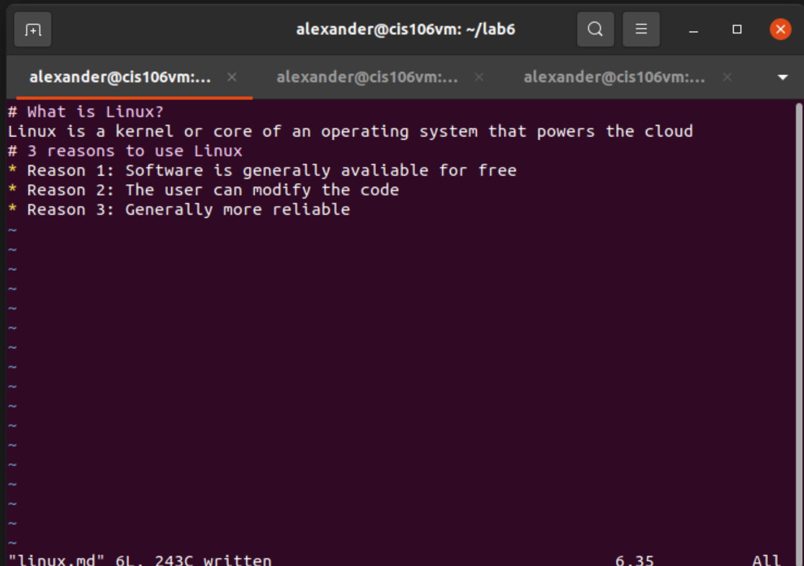

# Lab 6 Answers

[Linux.md](https://github.com/agomezlopez/cis106/blob/main/imgs/lab6/linux.md)
[Linux+other.md](https://github.com/agomezlopez/cis106/blob/main/imgs/lab6/linux%2Bother.md)
[GNU+Linux.md](https://github.com/agomezlopez/cis106/blob/main/imgs/lab6/GNU%2BLinux.md)